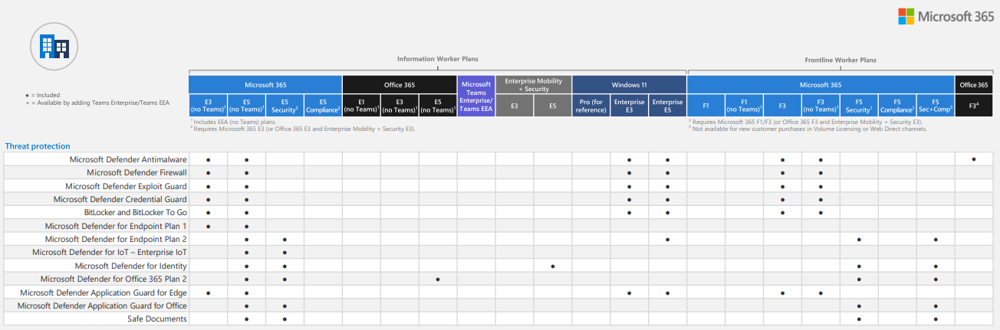

# Ressurser fra Webinar "Lytt til immunforsvaret" - Antiviruslogger

## Guider og nyttige lenker

[Microsofts oversikt for Defender for Endpoint](https://learn.microsoft.com/en-us/defender-endpoint/microsoft-defender-endpoint)

[Get started with your Microsoft Defender for Endpoint deployment](https://learn.microsoft.com/en-us/defender-endpoint/mde-planning-guide)

[Defender for Endpoint onboarding Windows client devices](https://learn.microsoft.com/en-us/defender-endpoint/onboard-windows-client)

[Onboard Windows servers to the Microsoft Defender for Endpoint service](https://learn.microsoft.com/en-us/defender-endpoint/configure-server-endpoints)

## Lisens



[Minimum requirements for Microsoft Defender for Endpoint](https://learn.microsoft.com/en-us/defender-endpoint/minimum-requirements)

[Overview of Microsoft Defender for Endpoint Plan 1](https://learn.microsoft.com/en-us/defender-endpoint/defender-endpoint-plan-1)

[What is Microsoft Defender for Business?](https://learn.microsoft.com/en-us/defender-business/mdb-overview)

## Varsling

Både Graylog og Defender har mulighet for å sette opp varsling.

[Guide for Defender for Endpoint](https://learn.microsoft.com/en-us/defender-xdr/configure-email-notifications)

[Guide for Graylog](https://graylog.org/resources/setting-up-events-and-alerts-in-graylog/)


## Graylog
Dette er vårt oppsett for en minimal Graylog-server som kan lagre og vise antiviruslogger fra deres nettverk. Dette er tiltenkt å være gjennomførtbart for alle, og vil ikke skalere bra for andre oppgaver enn kun å hente antiviruslogg.

For mer informasjon om sentralisert logging, se vårt [tidligere webinar](https://vimeo.com/797710070/b659357f08) på dette temaet

### Verktøy som brukes:

[GrayLog](https://graylog.org/downloads/) - Open Source Loggsamling- og analyseverktøy

[PSGELF](https://github.com/jeremymcgee73/PSGELF) - PowerShell-modul for å sende GELF-logger


### Installer en graylog-server

Vi anbefaler å bruke [Graylogs guide for installasjon](https://go2docs.graylog.org/current/downloading_and_installing_graylog/installing_graylog.html).

For webinaret installerte vi Graylog på en virtuell Ubuntu 22.04 maskin i Azure, der vi fulgte [denne guiden](https://go2docs.graylog.org/current/downloading_and_installing_graylog/ubuntu_installation.htm), men velg hva enn som funker best for deres nettverk.

I vår løsning ble Graylog-serveren satt opp med en Graylog Data Node som kjører på samme maskin. Dette anbefales ikke av Graylog, men for dette use-caset så er det tilstrekkelig.

### Sett opp data input for GELF TCP

Etter å ha installert Graynode, logg inn i Graylog sitt webgrensesnitt og naviger til 

```graylogserver:9000/system/inputs ```

For "Select input", velg GELF TCP, og "Launch new input".

Gi den ett navn og la ```Bind address``` stå som ```0.0.0.0``` for å bruke samme IP-addresse som webgrensesnittet for å sende inn logger.

### Bruk powershell for å sende logger inn

Installer [PSGELF powershell-modulen](https://github.com/jeremymcgee73/PSGELF)

I dette gitrepoet har vi lagt et eksempelscript som kan brukes for å sende over antiviruslogger til Graylog-serveren. Dette scriptet ble brukt i demoen, og er ment til å settes opp til å kjøre hvert minutt for å sende antiviruslogegr til Graylog.

Dersom scriptet ikke finner noen logger, gjør det ingenting, og om det er kommet inn antiviruslogger så blir disse sendt over til Graylog-serveren.

### Hvilke logger sender scriptet?

Scriptet er satt opp til å sende over kun de antivirusloggene som er kritiske. Antivirusloggen har mye mer informasjon, men det er følgene EventIDer som sendes:

```1006``` - The antimalware engine found malware or other potentially unwanted software

```1015``` - The antimalware platform detected suspicious behaviour

```1116``` - The antimalware platform detected malware or other potentially unwanted software

```5001``` - Real time protection was disabled

```5004``` - The real-time protection configuration changed

```5007``` - The antimalware platform configuration changed

```5008``` - The antimalware engine encountered an error and failed

```5010``` - Scanning for malware and other potentially unwanted software is disabled

```5012``` - Scanning for viruses is disabled

```5013``` - Tamper protection blocked a change to Defender Antivirus

Se den [komplette listen](https://learn.microsoft.com/en-us/defender-endpoint/troubleshoot-microsoft-defender-antivirus) med EventIDer fra Microsoft for mer informasjon om eventene
